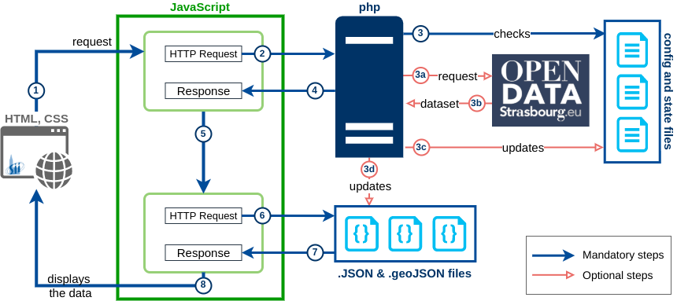

# #Strasbourg by SII

### strasbourg-data/

* **.gitignore**: list of files to be ignored by git.  
* **.htpasswd**: hashed key for the admin password. ***don't forget to update !***  
* **Accueil.html**: Home page. Title can be modified l15-17.

The page title and the 'loading sentence' displayed in the header of each page can be changed :
* **Arbres.html**: l17 and l19.
* **Decheteries.html**: l18 and l20.
* **Mairies.html**: l18 and l20.
* **Parcs.html**: l17 and l19.
* **Parking.html**: l20 and l22.
* **Piscines.html**: l17 and l19.
* **Trafic.html**: l18 and l20.
* **Velo.html**: l20 and l22.
* **Vitaboucles.html**: l17 and l19.
* **WC.html**: l17 and l19.

### strasbourg-data/admin

Folder protected by the password which hashed key is in `.htpasswd` file.  

* **.htaccess**: protects the folder.  
***line 3 to be updated with the new abolute path of the .htpasswd file !***  
Only works with Apache server. For other servers, see end of this document.  

* **Admin-connect.html**: HTML file for the admin page.
* **scriptAdmin.js**: Javascript for the HTML page. Lines 1-3 are the paths to the config and state files. Text written in each *card* element of the admin page can be changed **line 45** ('header') :  
`'Format', 'Précision url', 'Dernière MAJ', 'Il y a', 'Délai entre 2 MAJ', 'Visites'`

### strasbourg-data/demoJson

`.json` and `.geojson` outdated files, kept for the purpose of demonstration.

### strasbourg-data/Images

General images for each category of the application for the **home page**.  
Filename syntax: `logo-categoryid.png`.

##### strasbourg-data/Images/SideNav

General images for each category of the application for the **side navigation menu**.  
Filename syntax: `side-categoryid.png`.

##### strasbourg-data/Images/Icons

All other images used in the application, mainly icons for Leaflet maps.

* Gerenal Icons :
    * cathedraleSII.png: website logo, used as a favicon for all pages.
    * cathedraleSIIwhite.png: website logo, used in the side navigation menu and admin page.
    * sii.png: logo used on every map for SII marker.
    * noaccess.png: no wheelchair access logo.
    * wheelchair.png: wheelchair access logo.

* Home page :
    * admin.png: used as link to the Admin page.
    * realTime.png: displayed next to the 'real time' pages in the dropdown menus.

* Parking page :
    * blackParking.png: closed parking icon.
    * greenParking.png: open parking icon.
    * greyParking.png: no info parking icon.
    * orangeParking.png: almost full parking icon.
    * redParking.png: full parking icon.
    * warning.png: displayed in the *cards* elements when parking is almost full.

* Pool page :
    * closedPool.png
    * noInfoPool.png
    * openPool.png

* Townhall Page :
    * closedTownhall.png
    * noInfoTownhall.png
    * openTownhall.png

* Other pages :
    * bike.png: icon for vel'hop stations.
    * park.png
    * tree.png
    * waste.png
    * wc.png

### strasbourg-data/json

* **.empty**: empty file tracked by git for the folder creation. ***to be deleted when the website is working***
* **.json** and **.geojson**: datasets downloaded from the OpenData Strasbourg by the php program. *Not tracked by git.*

### strasbourg-data/Leaflet

Leaflet-specific CSS and Javascript files for the map and the marker clusters.

##### strasbourg-data/Leaflet/images

Default images for marker-icon, marker-shadow and layers icon.

### strasbourg-data/php

* **pageUpdate.php**: gets the variable part of the download address for each dataset of a given page. Verifies in the upDate.txt file if the dataset is to be updated. Returns a string with the status of the update (update / no-update / failed), dataset path (depending on demo-mode), page visits and last update of the files.  
`status; path; total visits; last month visits; this month visits; timestamp`.
    * l11: url base for the download of the datasets.
    * l13-16 : config and state files paths.

##### strasbourg-data/php/configFiles

* **.htaccess**: protects the folder.  
***line 3 to be updated with the new abolute path of the .htpasswd file !***  
Only works with Apache server. For other servers, see end of this document.  

* **config.php**
    * l1: demonstration mode
    * l2: dataset path if not in demo-mode
    * l3: dataset path if in demo-mode

* **configJson.txt**: one line for each dataset. Syntax:  
`Page short name; category name; dataset-name; format; url options if necessary; -XX units`
with *-XX units* being the max period to wait before updating the file, ie. *-30 days* or *-2 minutes*.
File generated by the php program.

##### strasbourg-data/php/stateFiles

* **.htaccess**: protects the folder. Only works with Apache server. For other servers, see end of this document.
***line 3 to be updated with the new abolute path of the .htpasswd file !***

* **countDate.txt** : last count date, used for the monthly counts resets. *Not tracked by git.*

* **counts.txt**: counts the visits on the different pages. Construction is the following :  
`Page short name; total visits; last month visits; this month visits`
File generated by the php program. *Not tracked by git.*

* **upDate.txt**: stores the last update timestamp for each dataset. Construction is the following :  
`dataset-name; timestamp`
File generated by the php program. *Not tracked by git.*

### strasbourg-data/Scripts

Javascripts used by (almost) all pages :
* **ajax.js**: general functions for all the scripts.

* **catsouscat.js**: information used by the *home page* and the *side navigation menu* scripts, with name and id of categories, name, url and realtime state of the pages.

* **config.js** :
    * l1: `websiteName` - added to the title of each page.
    * l2: `favicon` - added to each page.
    * l3: `coordSII` - SII coordinates.
    * l4: `logoSII` - path to the SII logo used for the marker.
    * l5: `titleSII` - title in the SII-marker popup for every map.
    * l6: `defaultTextSII` - default text in the SII-marker popup.
    * l7: `demoText1` - Text displayed in the header in demo-mode in place of the date.
    *l8 : `demoText2` - Text displayed in the header in demo-mode in place of the dataset age.

* **scriptMaps.js**: script for all pages with a Leaflet map that creates the basic map and all the icons.
    * l9, l16, l24: tile layers added to the map.
    * l31: map layer control, where the names can be changed.

* **scriptSidenavFooter.js**: script for the side menu and footer construction on each page except home and admin pages.

Javascripts for each page of the application, with page name and json files names as first lines.
* **scriptAccueil.js**: script for the page `Accueil.html`.
* **scriptArbres.js**: script for the page `Arbres.html`.
* **scriptDecheteries.js**: script for the page `Decheteries.html`.
* **scriptMairies.js**: script for the page `Mairies.html`.
* **scriptParcs.js**: script for the page `Parcs.html`.
* **scriptParking.js**: script for the page `Parking.html`.
* **scriptPiscines.js**: script for the page `Piscines.html`.
* **scriptTrafic.js**: script for the page `Trafic.html`.
* **scriptVelo.js**: script for the page `Velo.html`.
* **scriptVitaboucles.js**: script for the page `Vitaboucles.html`.
* **scriptWC.js**: script for the page `WC.html`.

### strasbourg-data/Stylesheets

* **font-style.css**: main font style link ('Dosis').

* **styleMain.css**: stylesheet for all pages. If you want to change the colors :
    * Default colors :
        * l10: default font-color for all text.
        * l11: default page background-color.
        * l39: default font-color for all header text.
        * default background-color for :
            * l48: **admin** and **home** header pages,
            * l899: **home** button in the side navigation menu,
            * l460: **h1** title (main title) of *card* elements.
        * l199: background-color for *popups* and *info* control headers.
        * l211: background-color for *SII popup* header.
    * **Administration** elements: l59, l63, l67;
    * **Balades** elements: l75, l79, 84;
    * **Decheteries** elements: l91, l95, l99;
    * **Sport** elements: l106, l110, l115;
    * **Deplacements** elements: l122, l126, l132;
    * **WC** elements: l139, l143, l147.

## Exchanges between Front-end and Back-end



## Deployment

This application can be integrated into any website structure : `www.yourwebsite.you/strasbourg-data`.
This is nearly ready-to-use. A few things to update or pay attention to :

* `json/` and `php/stateFiles` folders **must** be able to be 'written' by the server user.

* **.htpasswd**: update the hashed key for the admin password\*.

* **.htaccess**: in `admin/`, `php/configFiles` and `php/stateFiles` folders. Line 3 is to be updated with the new **abolute path** of the `.htpasswd` file\*.

* **Scripts/config.js**: the dataset-files paths (json) can be updated but ***must*** be an existing folder. The php program *will not* create a new folder, only new files.

* **json/.empty** can be deleted.

\*Only works with Apache server. For other servers, see just below.  

### If you are using Nginx server

You need to update the config file (usually in `/etc/nginx`) of your server with the following:

```sh
```location ~ ^/strasbourg-data/?.*/\.[^/]+$ {
```        deny all;
```}
```location ~ ^/strasbourg-data/(admin/|php/configFiles/|php/stateFiles) {
```        auth_basic "Merci de vous authentifier";
```        auth_basic_user_file "/srv/http/strasbourg-data/.htpasswd";
```}
```
* If the application is integrated into a website, it has to be specified into the Nginx config.
* The **absolute path** to the `.htpasswd` file would also need updating.
* Apache **.htaccess** files can be deleted or left as they are. 

### If you are using another server

~~Well, good luck with this !~~ The following folders are to be protected with **http basic authentification** :
* strasbourg-data/
* strasbourg-data/php/configFiles
* strasbourg-data/php/stateFiles

Apache **.htaccess** files can be deleted or left as they are. 

## This application was tested on...
Servers : 
* Apache 2.4.41 (on Ubuntu 19.10)
    * with php 7.3
* Nginx 1.10.3 (on Debian 9)
    * with php 7.3

Browsers :
* Chromium / Chrome 80.0.3987.x
* Firefox 75.0